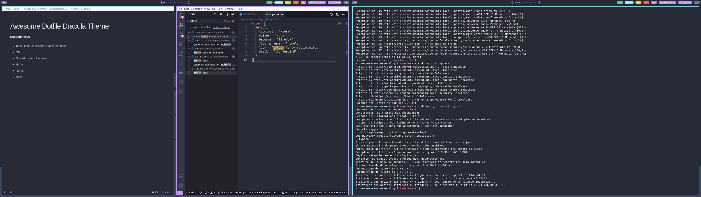

# Awesome DotFiles

**Neovim config**

Install The Silver searcher for grep : `brew install the_silver_searcher` or `apt install silversearcher-ag`.
Install Fzd for ctrlP : `brew install fzf ` and `$(brew --prefix)/opt/fzf/install`  or `sudo apt install fzf`

**Install Script**

Before : install Stow on your system.

`chmod -x install.sh && ./install.sh`

**Dependencies** :

- Awesome WM
- neovim
- tmux
- lains
- rofi
- i3lock-fancy-multimonitor
- xterm
- firefox
- git
- zsh
- Xterm
